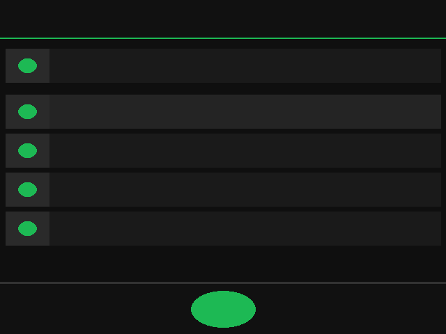

# 🎵 Musify

A compact, dark-mode music streaming app for Termux Desktop — built with Python + CustomTkinter + yt-dlp.



## Features

- 🔍 **Search** — Live YouTube Music search for any song or artist
- ▶️ **Stream** — Plays audio directly via mpv, no downloads needed
- 🎨 **Modern UI** — Compact dark design with album art thumbnails
- ⏯️ **Full Controls** — Play, pause, skip, prev, volume slider
- 📋 **Queue** — Auto-plays next search result when track ends
- 📱 **Compact** — Designed for Termux Desktop screen sizes

## Requirements

| Package | Purpose |
|---------|---------|
| `python-tkinter` | GUI framework |
| `customtkinter` | Modern UI components |
| `Pillow` | Image handling |
| `yt-dlp` | YouTube search & streaming |
| `mpv` | Audio playback |
| `ffmpeg` | Audio codec support |

## Project Structure

```
Musify/
├── main.py               ← Entry point
├── requirements.txt
├── install.sh
├── uninstall.sh
├── launch.sh
├── app.desktop
└── src/
    ├── app.py            ← Full CustomTkinter UI
    ├── search.py         ← YouTube search + stream URL resolver
    └── player.py         ← mpv audio player wrapper
```

## Run from source

```bash
pip install customtkinter Pillow yt-dlp
pkg install mpv ffmpeg python-tkinter
python3 main.py
```

## Usage

1. Type a song or artist name in the search bar
2. Press Enter or click **Search**
3. Click **▶** on any track to start streaming
4. Use the bottom player bar to pause/resume/skip
5. Adjust volume with the slider

## License

MIT
